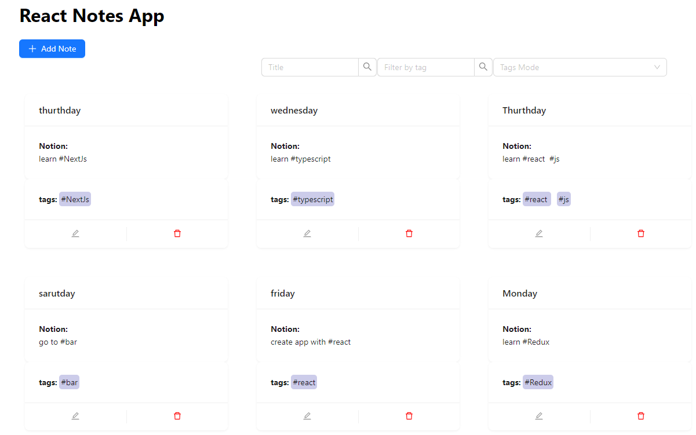

# React Notes Text Editor

This is a single-page application (SPA) built in React.js with TypeScript, using React Toolkit and Ant Design, that serves as a text editor for notes with tags. It provides various functionalities to create, edit, and delete notes, view the list of notes, create tags using the '#' symbol, filter notes by tags, and save notes persistently.

## Functionality

Creating, Editing, and Deleting Notes: Users can create new notes, edit existing notes, and delete unwanted notes. The text editor provides a user-friendly interface to enter and modify note content.

Viewing the List of Notes: The application displays a list of all the notes created by the user. Each note is represented by its title or a preview of its content.

Creating Tags with '#' Symbol: While creating or editing a note, users can create tags by prefixing them with the '#' symbol. For example, entering the text "I wanna go to #shop tomorrow" will create a corresponding tag named "shop". As users continue typing, the tags will be dynamically created and appear in a list below the text field.

Highlighting Tags in Note Content: When editing a note, all words that correspond to tags will be automatically highlighted. This feature helps users quickly identify and manage tags within their notes.

Filtering Notes by Tag: Users can filter the list of notes by selecting one or more tags from the existing ones. Only the notes containing the selected tags will be displayed, making it easier to navigate and find specific notes.

Persistent Storage of Notes: The application ensures that notes are saved even when the page is reloaded. It utilizes IndexedDB, a browser-based database, to store notes securely on the client-side.

### `npm start`

Runs the app in the development mode.\
Open [http://localhost:3000](http://localhost:3000) to view it in the browser.

## Technologies Used

React.js: A JavaScript library for building user interfaces.
TypeScript: A typed superset of JavaScript that compiles to plain JavaScript.

React Toolkit: A set of tools and utilities for building React applications efficiently.

Ant Design: A popular UI library for React with a set of customizable and reusable components.

IndexedDB: A browser-based database for storing data persistently on the client-side.

HTML: Markup language for creating the webpage structure.

CSS: Styling language for designing the application's appearance.

## License
This project is licensed under the MIT License. Feel free to use, modify, and distribute the code for personal and commercial purposes.